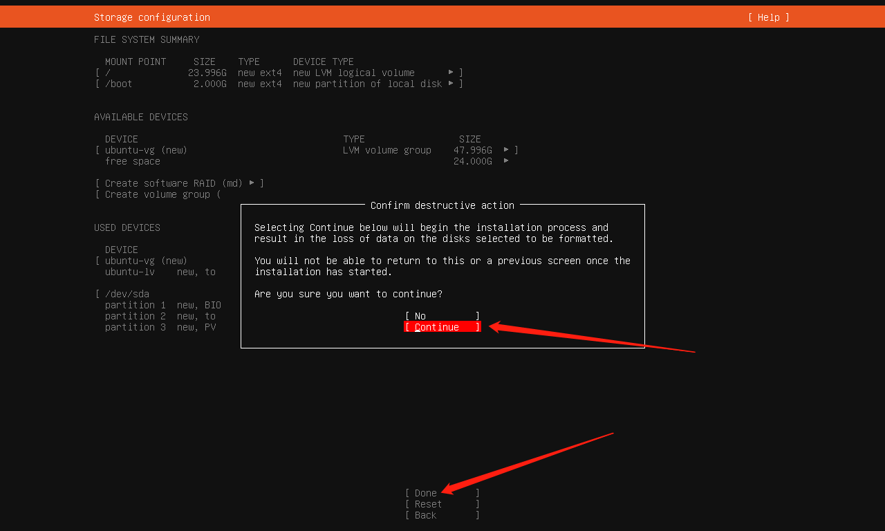

# Hadoop 真分布式安装笔记


## 所需软件及安装包

- `VMware`:  [VMware® Workstation 17 Pro](https://www.vmware.com/go/getworkstation-win)

- `Linux`: [ubuntu-22.04.2-live-server-amd64.iso](https://mirrors.aliyun.com/ubuntu-releases/jammy/ubuntu-22.04.2-live-server-amd64.iso) ( desktop也可以考虑, 不过比较吃电脑 )

- `Hadoop`: [hadoop-3.3.5.tar.gz](https://mirrors.aliyun.com/apache/hadoop/common/hadoop-3.3.5/hadoop-3.3.5.tar.gz)

- 存储虚拟机的空间留够`30G` (仅安装)

## 基础知识:

- 掌握 `vim` 编辑器 : [b站教程](https://www.bilibili.com/video/BV13t4y1t7Wg/)
- Linux 的基本命令操作 以及 Linux 如何添加环境变量

- 以下内容的用户名皆使用hadoop用户


## 第一步创建`Datanode`节点的虚拟机

### 打开VMware


### 单击创建新的虚拟机


### 虚拟机配置


### 打开虚拟机


### 选择安装ubuntu


### 配置Ubuntu

选择需要鼠标进入虚拟机界面并单击 (获取聚焦) 并使用**确认键** (Enter)   

退出可使用`Ctrl` + `Alt`按键


#### 配置静态IP

静态IP是为了让每次进入虚拟机时虚拟机的IP都保持不变, 否则每次重启都将重新设置某些关于IP的配置

使用上下键可以选择


这里的配置: 

- `Subnet` : 子网 **需要跟虚拟机的虚拟网卡子网一致**

- `Address` : 静态的IP **处于子网之内**

- `Gateway` : 网关 **需要跟虚拟机的虚拟网卡网关一致**

  不理解可以看 **[VMware的三种虚拟网卡](https://blog.csdn.net/lyf_ldh/article/details/78695357)**


### 设置apt镜像网站

**网址:** 

> http://mirrors.aliyun.com/ubuntu

填入后进行下一步





### 安装完成并重启


## 第二步登录Ubuntu并安装Java环境


### 登录Ubuntu

输入刚刚的用户名并输入密码 (**密码不会在屏幕上显示 输入完回车即可**)


### 更新apt软件

```shell
sudo apt update
```


输入用户密码以获取权限


...

#### 如果出现DNS错误时 [参见此文章](https://blog.csdn.net/yulei_qq/article/details/104261296)

### 让vim显示行号

编辑 `/etc/vim/vimrc ` 让vim编辑器显示行号

```shell
sudo vi /etc/vim/vimrc
```


按`i`并在末行添加 `set number`


然后`esc` `:wq`保存退出


### 安装java环境

```shell
sudo apt -y install openjdk-8-jdk
```


如果出现一下页面直接回车即可


然后记住 `/usr/lib/jvm/java-8-openjdk-amd64` (可能会略有差异, 可以前往/usr/lib/jvm下自行查看) 这个路径

#### 将Java路径添加到用户变量

```shell
sudo vi ~/.bashrc
```

在文末添加三行`export`


然后使用

```shell
source ~/.bashrc
```

更新文件

## 第三步安装SSH配置免密登录

#### 安装 `ssh` 和 `pdsh`

```shell
sudo apt-get -y install ssh
```


```shell
sudo apt-get -y install pdsh
```

然后在`~/.bashrc`文件添加 (方法同上添加Java环境)

```shell
export PDSH_RCMD_TYPE=ssh 
```


然后

```shell
sudo echo ssh >> /etc/pdsh/rcmd_default
```

紧接着使用

```shell
pdsh -q -w localhost
```

校验: 如果 `Rcmd type` 为 `ssh` 即为成功


#### 生成密钥

```shell
ssh-keygen -t rsa -P '' -f ~/.ssh/id_rsa
cat ~/.ssh/id_rsa.pub >> ~/.ssh/authorized_keys
```

单机测试免密登录(本机连接本机)

```shell
ssh localhost
```

弹出提示时 输入`yes`


成功: 


退出使用`exit`

如果提示`port 22 connection refused`

请先安装`openssh-server`

```shell
sudo apt-get install openssh-server
```

然后重新测试

## 第四步克隆虚拟机


输入 `poweroff` 关闭此虚拟机 若权限不够可在前面加上`sudo `


**同理再添加一个`Namenode2`**

现有三台虚拟机: 


### 然后更改 克隆出来的两台虚拟机的静态IP地址

打开`Namenode1` (另外两个不建议打开)

然后修改静态IP配置 

不同设备的`yaml`文件名可能不一样, 一般都只有一个, 那就是它了

输入到`sudo vi /etc/netplan/`时按`tab`键可自动补全这个唯一的文件: 

```shell
sudo vi /etc/netplan/***.yaml
```

然后将`address`下的`192.168.200/24`改为`192.168.201/24` ( 更改200成201即可 )


然后保存退出 使用

```shell
sudo netplan apply
```

更新配置

然后使用 `ip addr` 查看ip


已经更改成`192.168.201`

同理打开`Namenode2`更改其IP为202

### 更改hostname

然后使用`vim`编辑 `/etc/hostname`下的唯一一行名字成每个虚拟机对应的名字(小写即可)

如`Datanode`下:

 ```shell
 sudo vi /etc/hostname
 ```


然后保存退出 再重启: `reboot`

再次登录: 


可以看到系统的名字已经更换

然后另外两个分别命名为 `namenode1` 和 `namenode2` 操作同上

### 更改`hosts`

现在三台虚拟机对应的IP如下: 


整理一下: 

|  系统名   |     IP地址      |
| :-------: | :-------------: |
| Datanode  | 192.168.188.200 |
| Namenode1 | 192.168.188.201 |
| Namenode2 | 192.168.188.202 |

我们需要使用

```shell
sudo vi /etc/hosts
```

将以下内容添加到 `hosts`文件

```
192.168.188.200 datanode
192.168.188.201 namenode1
192.168.188.202 namenode2
```

同时呢将 `127.0.1.1 ubuntu` 这行注释掉 ( 在前面加上`#`即可) 


### 测试免密登录

在两台虚拟机内执行以下两个命令(主目录下)

```shell
scp hadoop@datanode:~/.ssh/id_rsa.pub  /home/hadoop/.ssh/datanode_rsa.pub
cat ~/.ssh/datanode_rsa.pub  >>  ~/.ssh/authorized_keys
```


然后在`Datanode`中测试:

```shell
ssh namenode1
ssh namenode2
```


连接成功

退出使用`exit`

## 第五步安装Hadoop

**如未提及以下操作均在 `Datanode`虚拟机 中执行

### 下载Hadoop

```shell
curl https://mirrors.aliyun.com/apache/hadoop/common/hadoop-3.3.5/hadoop-3.3.5.tar.gz --output hadoop.tar.gz
```

### 解压Hadoop

```shell
tar -zxvf hadoop.tar.gz # 解压到当前目录(主目录)
```

### 进入Hadoop安装目录

```shell
cd hadoop-3.3.5.tar.gz
```


### 添加Hadoop安装目录到用户环境变量

```shell
sudo vi ~/.bashrc
```


#### 更新环境变量并测试

```shell
source ~/.bashrc
hadoop # 输出hadoop的相关信息即可证明环境变量设置成功
```


### 修改配置文件

接下来需要修改的配置文件如下(都位于`/home/hadoop/hadoop-3.3.5/etc/hadoop`下): 

#### **hadoop-env.sh**

添加Java的环境变量 这个java变量同前面添加的一样


#### **core-site.xml**

添加如下配置

```
<configuration>
	<property>
		<name>fs.defaultFS</name>
		<value>hdfs://datanode:9000</value>
		<description>hdfs namenode port</description>
	</property>
	<property>
		<name>hadoop.tmp.dir</name>
		<value>/home/hadoop/hadoop-3.3.5/tmp</value>
		<description>A base for other temporary directories</description>
	</property>
</configuration>
```


#### **hdfs-site.xml**

```
<configuration>
	<property>
		<name>dfs.namenode.name.dir</name>
		<value>/home/hadoop/hadoop-3.3.5/dfs/name</value>
		<final>true</final>
	</property>
	<property>
		<name>dfs.datanode.data.dir</name>
		<value>/home/hadoop/hadoop-3.3.5/dfs/data</value>
		<final>true</final>
	</property>
	<property>
		<name>dfs.replication</name>
		<value>2</value>
		<final>true</final>
	</property>
	<property>
		<name>dfs.webhdfs.enable</name>
		<value>true</value>
	</property>
	<property>
		<name>dfs.secondary.http.address</name>
		<value>datanode:50090</value>
	</property>
</configuration>
```


#### **mapred-site.xml**

```
<configuration>
	<property>
		<name>mapreduce.framework.name</name>
		<value>yarn</value>
	</property>
</configuration>
```


#### **yarn-site.xml**

```
<configuration>
	<property>
		<name>yarn.resourcemanager.hostname</name>
		<value>datanode</value>
	</property>
	<property>
		<name>yarn.nodmanager.aux-services</name>
		<value>mapreduce_shuffle</value>
	</property>
</configuration>
```


#### **workers**


### 向其他虚拟机传输Hadoop文件

```shell
scp -r /home/hadoop/hadoop-3.3.5 hadoop@namenode1:~/
scp -r /home/hadoop/hadoop-3.3.5 hadoop@namenode2:~/
```


### 初始化`namenode`

(在Datanode的hadoop-3.3.5目录下)

```shell
bin/hdfs namenode -format # 在hadoop-3.3.5文件之下
```


### 启动Hadoop

(在Datanode的hadoop-3.3.5目录下)

```shell
sbin/start-dfs.sh
```

如若前面执行过启动Hadoop的命令需要先停止它

使用

```shell
sbin/stop-all.sh # 停止Hadoop命令 (需要等待十秒确认)
```


### 测试


